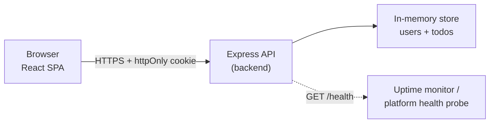
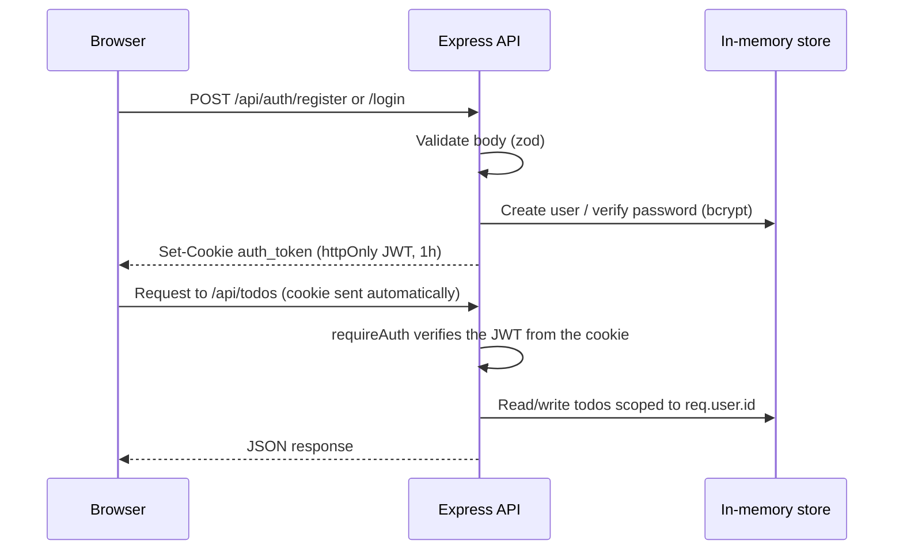

# React + Node.js Learning App

A full-stack learning application built with React (frontend) and Node.js/Express (backend) to understand full-stack concepts including cookie-based authentication and API security.

## Features

- **Frontend**: React with Vite, modern hooks API, component-based architecture, client-side routing with `react-router-dom`
- **Backend**: Node.js with Express.js, RESTful API design
- **Authentication**: Username/password login and registration, JWT sessions delivered via httpOnly cookies
- **Communication**: Axios (with credentials) for HTTP requests from React to Express
- **Functionality**: CRUD operations on a per-user Todo list (in-memory storage), gated behind login
- **Security**: helmet, strict CORS, rate limiting, bcrypt password hashing, zod input validation
- **Testing**: Jest + Supertest coverage for all auth and todo API endpoints
- **VS Code Integration**: Debug configurations, recommended extensions, and tasks

## Architecture

### System overview

The frontend never talks to the store directly — every read/write goes through
the Express API, which is the sole owner of the in-memory `users`/`todos`
data and the only place authentication/authorization decisions are made.

### Backend request pipeline
Every request passes through this middleware chain, in order
(`backend/src/app.js`). The order is deliberate: security headers and CORS
must be applied before anything else, and the health check is registered
before the rate limiter so uptime probes are never throttled.

1. `app.set('trust proxy', 1)` — read the real client IP from `X-Forwarded-For`
2. `helmet()` — security headers
3. `cors()` — enforce the single allowed `FRONTEND_URL` origin, with credentials
4. `compression()` — gzip responses
5. `morgan()` — request logging (skipped during tests)
6. `express.json({ limit: '10kb' })` — parse request bodies
7. `cookieParser()` — read the session cookie
8. `GET /health` — exempt from rate limiting
9. `rateLimit()` — global abuse guard (per-route auth limiter applies on top)
10. `/api/auth/*` and `/api/todos/*` routers (todos also run `requireAuth`)
11. `notFoundHandler` / `errorHandler` — catch-all 404 and centralized errors

### Authentication lifecycle

See **Security Configuration** below for the full list of hardening measures
applied at each of these steps.

### Backend layering (`backend/src/`)
- `routes/` — HTTP concerns: request validation (zod), status codes, response shape
- `middleware/` — cross-cutting concerns: `requireAuth` (session verification), `errorHandler` (centralized error responses)
- `data/` — persistence abstraction (`store.js`); swappable for a real database without changing routes (see **Data Persistence**)
- `utils/` — stateless helpers (JWT sign/verify)
- `config/` — shared constants (cookie name/options)

### Frontend architecture (`frontend/src/`)
- `context/AuthContext.jsx` is the single source of truth for auth state, restored via `GET /api/auth/me` on load
- `components/ProtectedRoute.jsx` gates the todo view, redirecting to `/login` when there's no session
- `services/apiClient.js` centralizes `withCredentials` and global 401 handling so individual pages don't reimplement cookie/session logic
- `pages/` (`LoginPage`, `RegisterPage`) and `components/TodoList.jsx` are presentation components that call `services/*` for all network I/O

## Project Structure

```
react-node-learning-app/
├── backend/                        # Node.js/Express server
│   ├── index.js                   # Entry point: loads env, starts the HTTP server
│   ├── src/
│   │   ├── app.js                 # Express app: security middleware, routes, error handling
│   │   ├── config/
│   │   │   └── authConfig.js      # Cookie name/options shared by auth code
│   │   ├── data/
│   │   │   └── store.js           # In-memory users/todos store
│   │   ├── middleware/
│   │   │   ├── auth.js            # requireAuth: verifies the session cookie
│   │   │   └── errorHandler.js    # Centralized error handling (no leaked internals)
│   │   ├── routes/
│   │   │   ├── auth.js            # /api/auth: register, login, logout, me
│   │   │   └── todos.js           # /api/todos: per-user CRUD, requires auth
│   │   └── utils/
│   │       └── jwt.js             # JWT sign/verify helpers
│   ├── tests/                     # Jest + Supertest tests for auth & todos
│   ├── package.json
│   ├── .env                       # Local environment variables (gitignored)
│   └── .env.example               # Template for .env
├── frontend/                       # React application
│   ├── src/
│   │   ├── components/
│   │   │   ├── TodoList.jsx       # Main todo component
│   │   │   └── ProtectedRoute.jsx # Redirects to /login when unauthenticated
│   │   ├── context/
│   │   │   └── AuthContext.jsx    # useAuth() hook: user state, login/register/logout
│   │   ├── pages/
│   │   │   ├── LoginPage.jsx
│   │   │   └── RegisterPage.jsx
│   │   ├── services/
│   │   │   ├── apiClient.js       # Shared axios instance (withCredentials, 401 handling)
│   │   │   ├── authService.js     # register/login/logout/getMe calls
│   │   │   └── todoService.js     # Todo CRUD calls
│   │   ├── App.jsx                # Routing (login/register/protected todo view)
│   │   ├── App.css                # App/todo/auth-form styles
│   │   ├── main.jsx                # React entry point
│   │   └── index.css               # Global base styles
│   ├── .env                       # VITE_API_URL pointing at the backend (gitignored)
│   ├── .env.example                # Template for .env
│   ├── index.html
│   ├── package.json
│   └── vite.config.js
├── .vscode/                        # VS Code configuration
│   ├── launch.json                 # Debug configurations
│   ├── tasks.json                  # npm tasks
│   └── extensions.json             # Recommended extensions
├── package.json                    # Root package.json with convenience scripts
└── README.md
```

## Setup Instructions

### Prerequisites

- Node.js `^20.19.0` or `>=22.12.0` (see the `engines` field in `package.json`; required by Vite 8)
- npm (comes with Node.js)
- VS Code (recommended for development experience)

### Installation

1. Clone or download this repository
2. Install dependencies for both frontend and backend:

```bash
# Install all dependencies (root script)
npm run install:all

# Or install separately:
cd backend && npm install
cd frontend && npm install
```

3. Create your local env files from the provided examples:

```bash
cp backend/.env.example backend/.env
cp frontend/.env.example frontend/.env
```

4. Generate a real `JWT_SECRET` for `backend/.env` (never use the placeholder value):

```bash
node -e "console.log(require('crypto').randomBytes(48).toString('hex'))"
```

Copy the output into `JWT_SECRET=` in `backend/.env`.

### Environment Variables

`backend/.env` (copy from `backend/.env.example`):

```
# Port 5000 is used by macOS AirPlay Receiver, so 5001 is the default here.
PORT=5001

# Set to "production" to enable secure (HTTPS-only) cookies.
NODE_ENV=development

# Origin of the frontend app, used for the CORS allow-list (exact match required).
FRONTEND_URL=http://localhost:5173

# Secret used to sign JWTs (generate with the command above). Never commit the real value.
JWT_SECRET=replace-with-a-long-random-secret
```

`frontend/.env` (copy from `frontend/.env.example`) tells the React app where the API lives:

```
VITE_API_URL=http://localhost:5001/api
```

Both `.env` files are gitignored since they're local configuration; only the
`.env.example` files are committed. The backend runs on port 5001 by default and the
frontend on port 5173 (Vite default). Port 5000 is intentionally avoided because macOS
reserves it for the AirPlay Receiver. If you change the backend port, update both files
so they stay in sync. If `FRONTEND_URL` doesn't exactly match the origin the browser
sends requests from, CORS will reject the request before the login cookie is ever set.

## Development Scripts

From the project root:

```bash
# Start both backend and frontend concurrently
npm run dev

# Start only the backend
npm run backend

# Start only the frontend
npm run frontend

# Install dependencies for both
npm run install:all

# Or separately:
npm run install:backend
npm run install:frontend

# Run the backend test suite
npm test

# Lint both frontend and backend
npm run lint
```

## Authentication

This app gates the Todo UI behind a login screen:

1. Visiting `/` while logged out redirects to `/login`.
2. New users can register via `/register` (username 3-32 chars, password 8+ chars).
3. On success, the backend issues a JWT stored in an `httpOnly`, `SameSite=Lax` cookie
   (never accessible to JavaScript) and the frontend calls `GET /api/auth/me` on load to
   restore the session from that cookie.
4. Todos are scoped per user — each account only sees and manages its own list.
5. Logging out calls `POST /api/auth/logout`, which clears the cookie.

Accounts are stored in-memory (see **Data Persistence** below), so registering again is
required after every backend restart.

## Testing

The backend has a Jest + Supertest suite covering both the auth and todo APIs:

```bash
cd backend
npm test

# Lint the backend (also available for the frontend via its own npm run lint)
npm run lint
```

Coverage includes:

- **Auth**: registration (success, duplicate usernames, validation errors), login
  (success, wrong password, unknown username — both return the same generic message to
  avoid user enumeration), logout, `GET /api/auth/me` (authenticated, unauthenticated,
  forged cookie), and the `/api/auth/*` rate limiter blocking excessive attempts.
- **Todos**: unauthenticated access is rejected, full CRUD happy paths, validation
  errors, 404s for missing/invalid ids, and per-user isolation (one user cannot read,
  update, or delete another user's todos).

Tests run against the real Express app (via `supertest`) with an in-memory store, so no
external database or running server is required. Rate limits are relaxed by default
during tests via `AUTH_RATE_LIMIT_MAX`/`RATE_LIMIT_MAX` env vars (set in
`backend/tests/jest.setup.js`) so functional tests aren't throttled, while a dedicated
test rebuilds the app with a very low limit to verify the 429 behavior itself.

## VS Code Development

Open this folder in VS Code. The IDE will:

1. Automatically detect recommended extensions (see `.vscode/extensions.json`)
2. Provide debug configurations:
   - "Launch Backend" - Debug the Node.js server
   - "Launch Frontend (Chrome)" - Debug the React app in Chrome
   - "Full Stack: Backend + Frontend" - Debug both simultaneously
3. Provide tasks for running development servers

## Learning Concepts Covered

### Backend (Node.js/Express)
- Setting up an Express server
- Middleware usage (cors, express.json, dotenv, helmet, cookie-parser)
- RESTful API design patterns
- HTTP methods (GET, POST, PUT, DELETE)
- Request/response handling and centralized error handling
- Environment configuration
- Authentication with JWTs and httpOnly cookies
- Password hashing with bcrypt
- Request validation with zod
- Rate limiting and other API hardening techniques
- Writing API integration tests with Jest and Supertest

### Frontend (React)
- Functional components and hooks (useState, useEffect, useContext, useCallback, useMemo)
- Component-based architecture
- State management
- Event handling
- Conditional rendering
- Styling with CSS
- API communication with Axios (including credentialed requests)
- Component lifecycle
- Client-side routing and route protection with React Router
- Global auth state via React Context

### Full Stack Integration
- CORS configuration for cross-origin, credentialed requests
- API endpoint consumption from frontend
- Asynchronous data fetching
- Cookie-based session handling between a SPA and an API server
- Development workflow with concurrent servers

## Security Configuration

This app is set up with the following production-oriented security measures:

- **Password storage**: bcrypt hashing (cost factor 12); plaintext passwords are never
  stored or logged.
- **Sessions**: short-lived JWTs (1 hour) delivered as an `httpOnly` cookie, so the
  token is inaccessible to JavaScript and mitigates XSS-based token theft. `secure` is
  enabled automatically when `NODE_ENV=production` (HTTPS-only).
- **No user enumeration**: login and registration return generic error messages, and
  login always runs a password comparison (even for unknown usernames) to keep response
  timing consistent.
- **Authorization**: every `/api/todos` request is scoped to the authenticated user via
  `requireAuth` middleware; users cannot see or modify each other's todos.
- **Input validation**: all request bodies are validated with `zod` before reaching
  business logic.
- **Headers**: `helmet()` applies standard hardening headers and removes `X-Powered-By`.
- **CORS**: locked to a single explicit `FRONTEND_URL` origin with `credentials: true`
  — no wildcard origins. The server fails fast at startup if `FRONTEND_URL` is unset in
  production instead of silently falling back to a localhost default.
- **Rate limiting**: a generous global limit plus a stricter limiter on `/api/auth/*` to
  slow brute-force/credential-stuffing attempts (both configurable via `RATE_LIMIT_MAX`
  / `AUTH_RATE_LIMIT_MAX`).
- **Reverse proxy awareness**: `app.set('trust proxy', 1)` ensures the app reads the real
  client IP from `X-Forwarded-For` when deployed behind Render/Railway/Fly.io/Nginx —
  without it, rate limiting would bucket every user behind the same proxy together.
- **Error handling**: a centralized error handler ensures stack traces and internals
  never reach the client.
- **Observability**: `morgan` request logging (concise in development, combined format
  in production) and a `GET /health` endpoint for uptime monitoring / platform health
  probes, exempted from rate limiting.
- **Response size**: `compression` middleware reduces response payload size.

## API Endpoints

`GET /health` (unprefixed) returns `{ status: "ok", uptime }` for uptime monitoring and
is exempt from rate limiting. All other endpoints are prefixed with `/api`.

### Auth (`/api/auth`)

- `POST /api/auth/register` - Create an account `{ username, password }`; sets the session cookie
- `POST /api/auth/login` - Log in `{ username, password }`; sets the session cookie
- `POST /api/auth/logout` - Clear the session cookie
- `GET /api/auth/me` - Return the current authenticated user (401 if not logged in)

### Todos (`/api/todos`) — all require an authenticated session

- `GET /api/todos` - Retrieve the current user's todos
- `POST /api/todos` - Create a new todo `{ text }`
- `PUT /api/todos/:id` - Update a todo `{ text?, completed? }`
- `DELETE /api/todos/:id` - Delete a todo

## Data Persistence

Users and todos are stored in-memory (`backend/src/data/store.js`) for simplicity while
learning. This means **all accounts and todos are lost whenever the backend restarts**.
To make data durable, swap this module for a real database (SQLite, PostgreSQL,
MongoDB, etc.) behind the same function signatures used by the routes.

## Deployment

### Backend (Node/Express) — e.g. Render, Railway, Fly.io, or a VPS

1. Point the host at the `backend/` directory. Build command: `npm install`. Start
   command: `npm start`.
2. Set environment variables on the host: `NODE_ENV=production`, a freshly generated
   `JWT_SECRET`, and `FRONTEND_URL` set to the exact deployed frontend origin (no
   trailing slash). The server refuses to start in production without `JWT_SECRET` or
   `FRONTEND_URL` set, so misconfiguration fails loudly instead of silently.
3. Ensure the platform serves over HTTPS — required for `secure` cookies to be sent.
4. If the platform asks for a health check path, use `/health`.
5. Remember: the in-memory store means data resets on every deploy/restart (see **Data
   Persistence** above).

### Frontend (React/Vite) — e.g. Vercel or Netlify

1. Set the project root/base directory to `frontend/`. Build command: `npm run build`.
   Output/publish directory: `dist`.
2. Set the build-time env var `VITE_API_URL` to your deployed backend's API base, e.g.
   `https://your-backend.onrender.com/api`.
3. Configure SPA fallback routing (rewrite unknown paths to `index.html`) so
   `react-router-dom` routes like `/login` don't 404 on refresh — Vercel/Netlify do this
   automatically for detected Vite apps.

### Cross-domain cookies

If the frontend and backend end up on different domains, the session cookie needs
`sameSite: 'none'` (in `backend/src/config/authConfig.js`) instead of `'lax'` for the
browser to send it cross-site. `sameSite: 'none'` requires `secure: true`, which is
already tied to `NODE_ENV=production` and requires HTTPS on both ends.

### Post-deploy checklist

- Register a user on the deployed frontend and confirm the `auth_token` cookie appears
  in DevTools with `HttpOnly`/`Secure` flags.
- Confirm `/api/todos` returns 401 without the cookie (e.g. in an incognito tab).
- Run `npm test` in `backend/` in CI before deploying to catch regressions.

## Customization & Extension Ideas

Once you understand the basics, try extending the application:

1. **Backend Enhancements**
   - Replace the in-memory store with a real database (SQLite, PostgreSQL, MongoDB)
   - Add refresh tokens / longer-lived sessions
   - Implement filtering, sorting, and pagination for todos
   - Add structured logging (e.g. Pino) and request tracing

2. **Frontend Enhancements**
   - Add editing capability for todos
   - Add component tests with React Testing Library
   - Add optimistic UI updates for todo mutations
   - Add a "forgot password" flow

3. **DevOps & Deployment**
   - Create Dockerfiles for both frontend and backend
   - Set up CI/CD pipelines (e.g. run `npm test` on every PR)
   - Deploy to Vercel/Netlify (frontend) and Render/Railway/Fly.io (backend)
   - Add HTTPS-only enforcement and security headers monitoring in production

## Troubleshooting

### Common Issues

1. **Port Already in Use**
   - Change `PORT` in `backend/.env` (and `VITE_API_URL` in `frontend/.env` to match)
   - Kill existing processes: `lsof -i :5001` or `lsof -i :5173`

2. **Empty responses / 403 on port 5000 (macOS)**
   - macOS runs the AirPlay Receiver on port 5000, which silently returns `403`
   - Either keep the backend on 5001 (default here) or disable AirPlay Receiver in
     System Settings → General → AirDrop & Handoff

3. **CORS Errors**
   - Ensure `FRONTEND_URL` in `backend/.env` exactly matches the origin the browser is
     making requests from (protocol, host, and port all must match)
   - Verify the frontend is making requests to the correct backend URL (`VITE_API_URL`)

4. **`Error: JWT_SECRET environment variable is required` on backend startup**
   - `backend/.env` is missing or doesn't define `JWT_SECRET`; copy it from
     `.env.example` and generate a value (see Setup Instructions, step 4)

5. **Logged in but `/api/todos` returns 401 / login doesn't "stick"**
   - Confirm `apiClient`/axios requests use `withCredentials: true` (already configured
     in `frontend/src/services/apiClient.js`)
   - Confirm `backend/src/app.js` CORS config has `credentials: true` and `FRONTEND_URL`
     matches the frontend's actual origin
   - If frontend and backend are on different domains in production, see **Cross-domain
     cookies** above

6. **`429 Too many attempts` while testing login/register manually**
   - You've hit the auth rate limiter (default 20 requests/15 min on `/api/auth/*`);
     wait for the window to reset or raise `AUTH_RATE_LIMIT_MAX` in `backend/.env`

7. **Dependency Installation Issues**
   - Delete node_modules and package-lock.json, then reinstall
   - Try using `npm ci` instead of `npm install`

## Built With

- [Node.js](https://nodejs.org/) - JavaScript runtime
- [Express.js](https://expressjs.com/) - Node.js web framework
- [React](https://reactjs.org/) - Frontend library
- [Vite](https://vitejs.dev/) - Frontend build tool
- [React Router](https://reactrouter.com/) - Client-side routing
- [Axios](https://axios-http.com/) - HTTP client
- [jsonwebtoken](https://github.com/auth0/node-jsonwebtoken) - JWT signing/verification
- [bcryptjs](https://github.com/dcodeIO/bcrypt.js) - Password hashing
- [cookie-parser](https://github.com/expressjs/cookie-parser) - Reads the httpOnly auth cookie
- [helmet](https://helmetjs.github.io/) - Security headers
- [cors](https://github.com/expressjs/cors) - Cross-origin resource sharing
- [express-rate-limit](https://github.com/express-rate-limit/express-rate-limit) - Rate limiting
- [compression](https://github.com/expressjs/compression) - Response compression
- [morgan](https://github.com/expressjs/morgan) - HTTP request logging
- [zod](https://zod.dev/) - Schema validation
- [dotenv](https://github.com/motdotla/dotenv) - Loads environment variables from `.env`
- [Jest](https://jestjs.io/) + [Supertest](https://github.com/ladjs/supertest) - API testing
- [oxlint](https://oxc.rs/docs/guide/usage/linter.html) - Linting (frontend and backend)
- [VS Code](https://code.visualstudio.com/) - Development editor

## Acknowledgements

This project was created as a learning exercise to understand full-stack development concepts with React and Node.js. Feel free to use, modify, and extend it for your own learning purposes.

Happy coding! 🚀
